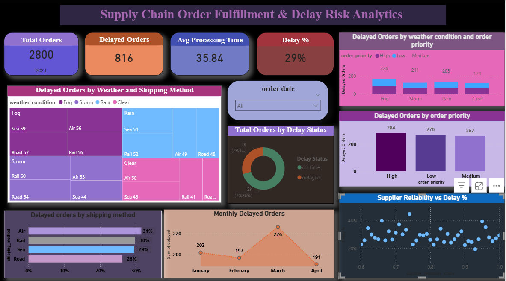

# Supply Chain Order Fulfillment & Delay Risk Analytics

## Project Overview
This project analyzes supply chain order fulfillment data to identify delivery delays and operational risks using Power BI.

## Tools Used
- Power BI
- Power Query
- DAX

## Dashboard Preview

## Key Insights
- Analyzed order fulfillment performance.
- Identified factors affecting delivery delays.
- Evaluated supplier and shipping performance.
- Developed an interactive dashboard for business insights.
